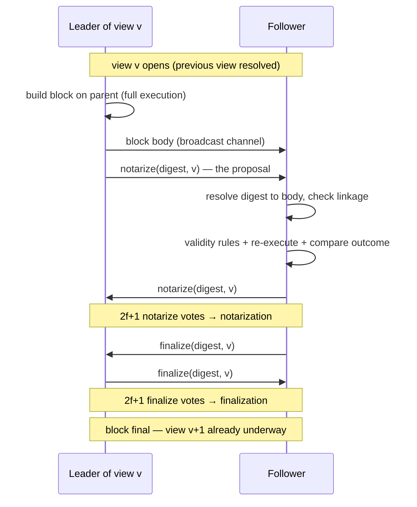
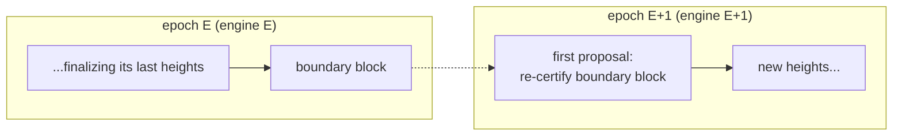
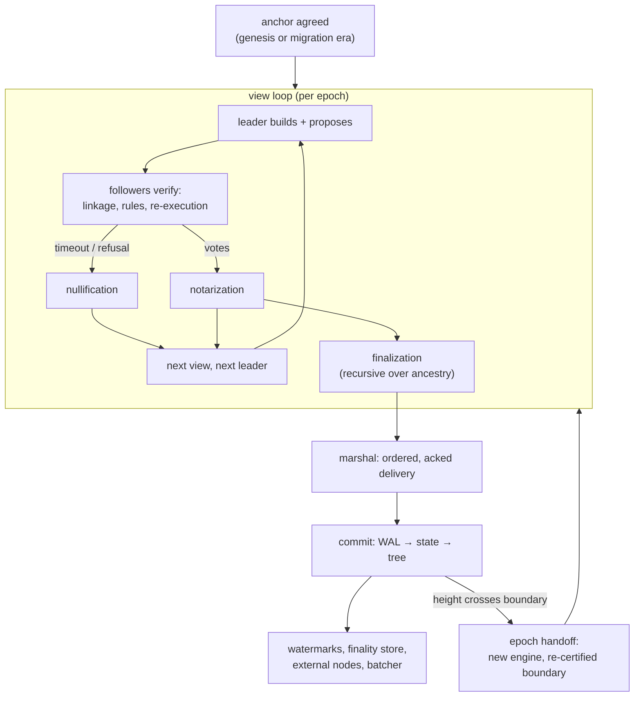

# The lifecycle

[What and why](intro.md) introduces the vocabulary and
[the integration chapter](integration.md) maps the machinery; both are about
*what* the pieces are. This page is about **sequence**: what happens first, what
must finish before what, and which orderings the protocol actually guarantees.
It walks the chain's life chronologically — the chain's start, one block's
journey, the views that fail, life after finality, epoch turnover. The precise
rules live in the protocol docs
of the `commonware-consensus` crate and in our module documentation; nothing
here overrides them.

## The clock

Three nested notions of time, from smallest to largest:

- A **view** is one leader's turn: at most one block can be notarized in it, and
  it either contributes a block to the chain or is skipped. Views are the unit
  of protocol progress.
- A **height** counts finalized blocks. Views without a block (skipped views)
  consume view numbers but not heights, so view numbers run ahead of heights.
- An **epoch** is a fixed-length span of *heights* (a deployment constant —
  hours of chain time in production). Views count within their epoch, so a
  position in consensus time is the pair `round = (epoch, view)`. Views restart
  from zero at every epoch boundary: **only the pair is monotone**, never the
  bare view number — anything that compares consensus progress must compare
  rounds, not views.

One non-obvious consequence, worth internalizing early because every
"where does the chain start" question below reduces to it: *consensus genesis
is not a block that gets voted on*. The starting block is **implicitly final**
— there is no certificate for it — and voting begins at view 1 with a proposal
that names it as parent.

## A chain enters consensus

Whether a chain is born with a committee or migrates into one later, consensus
always starts the same way: from an **anchor** — a `(height, hash)` pair that
every validator derives from its own chain data and that all of them must agree
on. For a brand-new chain the anchor is the chain's genesis block; for a chain
migrating from single-sequencer operation it is the exact block at which the
sequencer stopped. The anchor plays the role of the implicitly-final starting
block above: it is never re-voted, and the first proposal builds on it.

The sequence, for the migration case (the new-chain case is the same with an
empty history — [the runbook lives in the enabling chapter](enabling.md)):

1. Operators drain the single sequencer and note its final block: the anchor.
2. Each validator's node, on startup, **records the era** — the anchor — in its
   own durable state, and startup guards compare the recorded era against the
   configured one on every subsequent boot. A validator configured for a
   different era than its data refuses to start, loudly, with a remedy in the
   error: the one thing these guards exist to prevent is two committees'
   histories interleaving in one store.
3. Consensus starts. There is no "waiting for genesis" phase: the moment a
   quorum of validators is up and connected, the first view's leader proposes
   block `anchor + 1`, and the chain is growing again.

Rolling *back* to single-sequencer operation reverses the sequence with one
asymmetry worth knowing: finality can be slightly ahead of any single
validator's durable disk state (see [after finality](#after-finality)
below), so the rollback procedure picks the validator with the longest durable
history as the survivor. The guards force the operator to acknowledge a
rollback explicitly before the node will run as a lone sequencer on
consensus-era data.

## One view, step by step

The happy path: view `v` opens, its leader proposes, everyone votes twice, a
block is final. In sequence-diagram form, for a leader L and (representative)
follower F:

The same sequence in prose, with the orderings that matter:

1. **The view opens** for a validator when it sees the previous view resolve —
   a notarization or a nullification for `v−1`. Committee members do not tick
   over in lockstep; each enters `v` when the evidence reaches it. On entry,
   two timers arm: one for the leader's proposal (`leader_timeout`), one for
   the view making progress overall (`certification_timeout`).
2. **The leader builds first, proposes second.** Building is full execution
   ([execute-then-order](integration.md#execute-then-order-verify-before-vote)),
   so by the time anyone hears about the block it is already a complete,
   executed object whose record commits to its outcome. The body travels on the
   broadcast channel; what enters consensus proper is the 32-byte digest — and
   the proposal message *is* the leader's own notarize vote. There is no
   separate "propose" message to wait for.
3. **A follower votes only with the full picture.** Before voting it must hold
   the body (from broadcast, or fetched), see the parent linkage check out
   against a parent it knows to be notarized or final — with nullifications
   covering any skipped views between — and re-execute the block to the same
   outcome the leader declared. A follower that cannot assemble that picture
   does not vote against the block; it simply doesn't vote yet. **No validator
   ever vouches for ancestry it cannot see.**
4. **Certificates are assembled by whoever gets there first.** Votes flow
   validator-to-validator; any participant that collects `2f+1` notarize votes
   assembles the notarization certificate and rebroadcasts it. The leader has
   no special role after proposing — it is one voter among `n`.
5. **Notarization splits the flow in two.** The moment a validator holds the
   notarization for `v`, two things happen *concurrently*: it broadcasts its
   finalize vote for the block (unless it has nullified `v` — see below), and
   it **enters view `v+1`**. Consensus does not wait for finalization before
   moving on: the next leader is already building on the notarized block while
   finalize votes are still crossing the wire. Finality of view `v` typically
   lands one view "behind" the committee's leading edge.
6. **Finalization is retroactive and recursive.** A finalization certificate
   for view `v` finalizes the block *and its entire ancestry* — if some earlier
   block was notarized but its finalization never assembled (votes lost to the
   network, say), a descendant's finalization settles it too. This is why a
   validator that observes a single valid finalization from far ahead can trust
   everything beneath it.

## When a view goes wrong

Nullify is the protocol's "stop waiting" vote, and the scenarios that
trigger it are worth knowing individually — they are the ones you will see in
logs and tests:

- **The leader is silent**: `leader_timeout` fires with no proposal →
  broadcast `nullify(v)`.
- **The leader proposed an invalid block**: verification fails — structural linkage
  broken, a [validity rule](integration.md#validity-rules-bounding-the-inputs)
  refused it (whether *Invalid* or *Withhold* — the distinction is for
  operators, not the protocol), or re-execution disagreed with the declared
  outcome → broadcast `nullify(v)` **immediately**, no timer wait.
- **The leader itself cannot build** (nothing to propose, execution
  environment says no): the leader broadcasts `nullify(v)` for its own view
  right away, sparing everyone the timeout.
- **The leader gave up**: a `nullify(v)` from the view's own leader is treated
  by everyone else as an instant timeout — no point waiting for a proposal
  that isn't coming.
- **The view stalls after a proposal**: votes trickle but the notarization
  never assembles before `certification_timeout` → broadcast `nullify(v)`.
  Note this can happen *after* the validator already notarized — notarize-
  then-nullify in the same view is legal and routine.
- **The leader has been inactive for a while**: if a leader was inactive for the
  last `skip_timeout` views, its turn is skipped without waiting at all.

While stuck in a view, a validator rebroadcasts its nullify every
`timeout_retry` along with the previous view's certificate — so a partitioned
peer that comes back can see both *that* the committee is stuck and *why it is
entitled to be* in view `v` at all.

A quorum of nullifies assembles a **nullification** certificate: the view is
skipped, view `v+1` opens with the next leader, and that leader builds on the
latest *notarized* block (which may be from several views back, with
nullifications covering the gap). The two exclusion rules that hold all of
this together — the ones a validator's vote journal enforces across even a
crash and restart:

1. **Never notarize two different blocks in one view.**
2. **Never finalize a view you nullified** (and vice versa). Notarize + nullify
   may coexist; finalize + nullify never do.

Every vote is written to the **journal before it is broadcast** — fsync first,
network second. A validator that crashes mid-view replays its journal on
restart and simply cannot contradict what the network may already have seen.
This single ordering (disk before wire) is what makes crash-and-restart a
non-event for safety.

What about a block that was notarized but whose view got nullified? It survives
as a *candidate*: the next leader is expected to build on the latest notarized
block, so the usual outcome is that the block gets a descendant and is
finalized retroactively (recursion, above). It can also be abandoned if a
competing branch finalizes first —
[notarized is not finalized](intro.md#the-simplex-protocol), and the
speculative overlay for the abandoned branch is dropped without ever touching
disk.

## After finality

Everything up to the finalization certificate is *concurrent* — votes and
bodies crossing the wire in any order, views overlapping. Everything after
it is deliberately **serial**:

1. The marshal archives the finalized block and its certificate, then delivers
   finalized blocks to the node **strictly in height order, one ack at a
   time**. A recursively-finalized backlog (a catching-up validator) drains
   through the same path.
2. `commit` hands each block's already-computed outputs to the persistence
   pipeline — write-ahead log first, then state, repositories, tree — and the
   ack releases the next block. Consensus keeps voting far ahead of this
   (speculation is bounded, not blocked), but *durability* advances in order.
3. The activity observer, watching the same stream of certificates, writes
   each finalization into the [finality store](integration.md#the-life-of-a-block)
   and advances the **certified watermark** — the height up to which the node
   holds a complete, independently-verifiable proof trail.
4. Downstream consumers wake on the same ordered stream: external nodes pull
   replay records, the batcher folds finalized blocks into batches for
   settlement. None of them know consensus exists.

The ordering guarantee: **finality is the synchronization point.**
Before it, per-validator experiences legitimately differ (different arrival
orders, different speculative branches). After it, every validator's durable
history is byte-identical by construction — the only differences are *how far*
each one has gotten, which is precisely what watermarks measure. Finality also
runs slightly ahead of any single disk: a validator can crash having voted for
(and helped finalize) a block it never got to persist — recovery replays and
re-derives, and the [rollback procedure](enabling.md#rolling-back) accounts
for the gap.

## Epoch turnover

An epoch ends on a schedule, not on an event: the boundary is crossed when the
*chain height* crosses a multiple of the epoch length. Two facts make epochs more than
bookkeeping — the validator set is fixed **within** an epoch (committee changes
happen only at boundaries), and each epoch's engine journals under its **own
storage partition** (which is what makes old consensus scratch state prunable
by epoch, and a restart's journal replay bounded).

The handoff is an overlap, not a cut:

As the committed height approaches the boundary, the stack **starts the next
epoch's engine while the old one still runs** — each with its own journal, each
hearing only its own epoch's slice of the consensus channels (traffic is
multiplexed by epoch id; two engines never see each other's votes). The new
epoch does not take the old one's word for where the chain ended: its **first
proposal re-proposes the boundary block**, so the new epoch's own quorum
re-certifies, under its own round numbers, exactly where the previous epoch
stopped. Once the committed tip has moved past the old epoch, the old engine is
retired — its journal stays on disk, so even an unexpected restart into that
epoch cannot double-sign.

The extreme case is instructive: a validator that was down for one or more
*entire* epochs. Its old engine hears silence (peers have retired
that epoch's traffic), and its muxer discards current-epoch messages no local
engine has registered for — a validator could, naively, wait forever. The
way out is that finalization certificates are **self-proving**:
the stack watches for certificates from epochs it is not running, verifies the
quorum signature against the committee, and hands them to the marshal as
evidence of the real tip. The marshal backfills the missing blocks, committed
height climbs, and the rotation logic starts the engines the validator should
be running — catch-up ends in participation, with no operator action and no
special protocol.

## Network channels

The traffic, by channel, with its place in the sequence:

| Channel | What flows | When it matters |
| --- | --- | --- |
| transaction gossip | pending transactions, committee-wide | continuously, ahead of any view — so the next leader (whoever it is) has the mempool |
| votes | notarize / nullify / finalize (digests only) | the view state machine above |
| certificates | assembled notarizations / nullifications / finalizations | resolving views, waking laggards, tip discovery across epochs |
| certificate backfill | request/response for missed certificates | a validator stuck in a view its peers already resolved |
| block broadcast | full block bodies | between "leader built" and "follower verifies" |
| block backfill | request/response for finalized blocks + certificates | catch-up: restarts, partitions healing, fresh validators |

The three consensus channels (votes, certificates, certificate backfill) are
the epoch-multiplexed ones; the block channels and transaction gossip are
epoch-agnostic — blocks are blocks, whichever epoch finalized them.

## The complete flow

The other chapters add depth on each part:
[what the protocol guarantees](intro.md), [where the machinery lives](integration.md),
[how it is tested](testing.md), and [how to run it](enabling.md).
